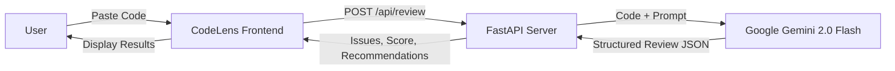

# 🔍 CodeLens AI — Gemini-Powered Code Review SaaS

> **XPRIZE Build with Gemini 2026** — Professional Services Category

AI-powered code review as a service. Get instant, intelligent feedback on your code powered by **Google Gemini 2.0 Flash**.

## 🏆 XPRIZE Submission

| | |
|---|---|
| **Category** | Professional Services |
| **Prize Pool** | $2,000,000 |
| **Team** | Solo Developer |
| **Tech** | Google Gemini API + FastAPI + Vanilla JS |

## ✨ Features

- 🛡️ **Security Analysis** — Detects hardcoded secrets, injection vulnerabilities, unsafe patterns
- ⚡ **Performance Insights** — Identifies bottlenecks, N+1 queries, memory issues
- 🎨 **Style Review** — Enforces best practices across 6+ languages
- 🤖 **Gemini-Powered** — Deep code understanding via Google Gemini 2.0 Flash
- 📊 **Live Dashboard** — Real-time stats and review history
- 💳 **SaaS Ready** — Tiered pricing ($0/9/29/mo), Stripe-ready

## 🏗️ Architecture



## 🚀 Quick Start

```bash
# Clone
git clone https://github.com/aldorizona10-glitch/xprize-gemini-codereview.git
cd xprize-gemini-codereview

# Setup
python3 -m venv venv
source venv/bin/activate  # or venv\Scripts\activate on Windows
pip install -r requirements.txt

# Configure (optional - works in demo mode without key)
cp .env.example .env
# Edit .env and add your GEMINI_API_KEY from https://ai.google.dev

# Run
uvicorn app.main:app --host 0.0.0.0 --port 8080

# Open http://localhost:8080
```

## 📸 Screenshots

| Landing Page | Code Review | Dashboard |
|-------------|-------------|-----------|
| Premium dark SaaS UI | Live Gemini analysis | Real-time stats |

## 🔌 API Endpoints

| Method | Endpoint | Description |
|--------|----------|-------------|
| `POST` | `/api/review` | Submit code for AI review |
| `GET` | `/api/reviews` | List past reviews |
| `GET` | `/api/reviews/{id}` | Get specific review |
| `GET` | `/api/stats` | Usage statistics |
| `GET` | `/api/health` | Health check |

### Example Request

```bash
curl -X POST http://localhost:8080/api/review \
  -H "Content-Type: application/json" \
  -d '{"code": "def hello():\n    eval(input())", "language": "python"}'
```

## 💰 Business Model

| Plan | Price | Reviews/mo | Features |
|------|-------|------------|----------|
| Starter | Free | 10 | Basic analysis, 2 languages |
| Pro | $9/mo | 100 | Deep analysis, 6 languages, API |
| Team | $29/mo | Unlimited | CI/CD, GitHub integration |

## 🔧 Tech Stack

- **AI Engine**: Google Gemini 2.0 Flash via `google-generativeai`
- **Backend**: FastAPI (Python)
- **Frontend**: Vanilla HTML/CSS/JS
- **Styling**: Custom CSS with glassmorphism, gradients, animations

## 📄 License

MIT

---

*Built with ❤️ and Google Gemini for XPRIZE Build with Gemini 2026*
